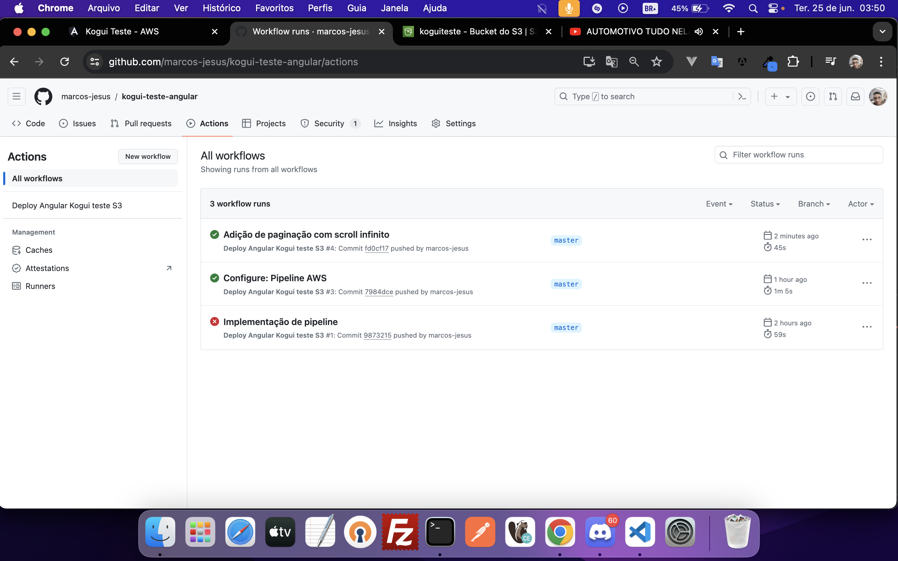

# Frontend Docs (LEIA)
**This project was generated with [Angular CLI](https://github.com/angular/angular-cli) version 14.0.6.**

O que estou usando:<br>
Linguagem: Javascript<br>
Framework: Angular 14.0.0 / CLI 14.0.6 <br>
RxJS: 7.50<br>
Typescript: 4.7.2<br>
Node: v18.20.3
Npm: v10.7.0

Bibliotecas usadas:

```bash
  # PrimeNg -> 14.2.3
  https://www.primefaces.org/primeng-v14-lts/
  #PrimeFlex -> 2.0.0
  https://github.com/primefaces/primeflex/wiki/PrimeFlex-v2
  #PrimeIcons -> 6.0.1
  https://www.primefaces.org/primeng-v14-lts/icons
  #ngx-infinite-scroll -> 14.0.1
  https://www.npmjs.com/package/ngx-infinite-scroll
```

## Development server
Para rodar essa aplicação é necessário rodar o script ng serve, aplicação local rodara na porta padrão do angular 4200.
http://localhost:4200/

## AWS
Criação de bucket no S3, pipeline etc...
Criado uma esteira de deploy automatizada CI/CD ao realizar o merge e push para branch master.

## Aplicação
http://koguiteste.s3-website-us-east-1.amazonaws.com/


